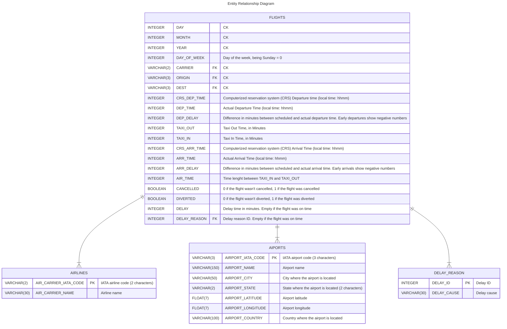

  

<h3 align="center">Flights</h3>

2023 U.S. Flights dataset   analyzed with a Tableau dashboard

    
    

---

# Flights
`2023 U.S. Flights dataset` contains information about all the flights that happened in the U.S. territory from January to December 2023.

`The main objective of this project is to create a Tableau dashboard to analyze the information retrieved`.

## Dataset information

  
Expand section

  
The dataset is composed by 4 different subsets (CSV formatted files):
- `airlines`: Contains all the information about the airlines that flew during the 2023 between two airports in the U.S. territory.
- `airports`: All the U.S. commercial airports during the 2023
- `delay_reasons`: Specifies the different types of delay that the flights suffered during the January-December 2023 period
- `flights`: The information about each flight. For example: flight time, expected departure and arrive time vs real departure and arrive time, delay information, cancelled or diverted flight, etc.

### Where was the dataset information obtained from?
The [Bureau of Transportation Statistics of the government of the United States](https://www.transtats.bts.gov/DL_SelectFields.aspx?gnoyr_VQ=FGJ&QO_fu146_anzr=b0-gvzr), has a lot of information that could be used to create our own dataset.

I retrieved the information of the subsets `flights`, `airports` and `airlines` from that page. You can find them inside the [raw folder](./src/data/raw) of this repository.

The `delay_reasons subset` was created from the `flights subset`, after analyzing the 3 subsets.

## Analysis

  
Expand section

**Step 1:**

- Run a dataset profiling. `ydata_profiling` was used to achieve this task and obtain valuable information about the different subsets.
  - The script to run that process is [create_profiling.py](./src/data/create_profiling.py)

**Step 2:**

With the information retrieved and with the objective of "creating a Tableau Dashboard" in mind, the next step was to remove the unnecessary data. 
- This part is the most important because that data will be then converted into information with the visualization of the Dashboard, and there was a lot of things that were not necessary or the format was not the one I needed.
- Imported the airlines and airports datasets into a Google Sheets document, and using the script [inspect_flights_subset.py](./src/data/inspect_flights_subset.py), I completed the subsets, adding the missing airlines and airports.

**Step 3:**

Lastly but not less important, the `flights subset` was cleaned up.
- Imported a sample of the January CSV, analyzed which columns added value to the future Tableau Dashboard, and which of them should be renamed, deleted or transformed.
- Expanded the `FL_DATE` column into 3 columns `DAY`, `MONTH` and `YEAR` (I could have download that data directly from the `bts.gov` page but as each download took a lot of time and I had that information in another column, I decided not to do that, and use the one I had to obtain the same result), and removed the hour because it was always 12:00:00
- Removed the unnecessary columns
- Created the `delay_reasons subset` to reduce the information of delays to 2 columns instead of 5 (in the `flights subset`). 
- Created the script [clean_flights_subset.py](./src/data/clean_flights_subset.py) to do this whole process

After all this analysis, the new subsets were created in the ['processed' folder](./src/data/processed).

This process helped me to reduce the `flights subset` size in MB, to the half.

## Relational model diagram

  
Expand section

---
## License
[MIT](https://choosealicense.com/licenses/mit/)

### Logo License
Author credit: [58pic from PNGTree](https://pngtree.com/freepng/cartoon-airplane-vector_4364890.html?share=3?sol=downref&id=bef)
